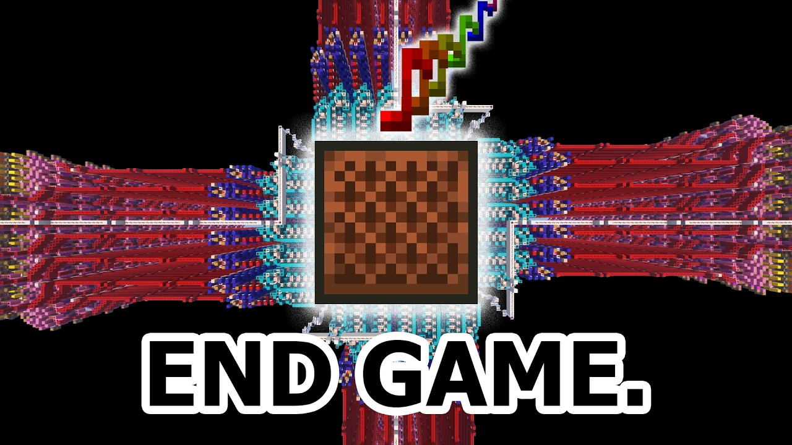
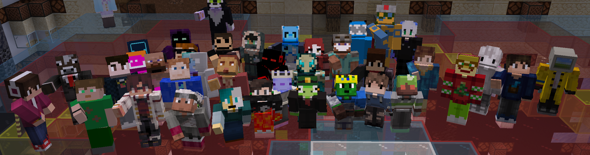

# M.A.E.S.T.R.O. Mod Pack
A lightweight pack designed to provide you with the tools to test creations for [M.A.E.S.T.R.O.](https://youtu.be/G78AnHpIw5w), an incredible redstone machine that lets you play Note Block Songs (created with [Note Block Studio](https://noteblock.studio)) in vanilla Minecraft, and everything you'd want while attending the *Maestro's Musical Masterpieces* live event.

Everything is stripped down to its bare minimum, utilities and optimizations are baked-in for the smoothest experience, and the required world is provided and ready to use!

Now that the event has been concluded, this pack can be used to hear all of the songs that were played live ([listen to them here](https://youtu.be/oIy8fCNciUU?t=3135)), and will continue to function as a great testing and listening ground for future M.A.E.S.T.R.O. creations.

### Using the MAESTRO converter
Head to the [converter website](https://vladdesv.github.io/maestro) and drag in your saved NBS file to convert it to a WorldEdit-compatible schematic file. Copy this file to the `config/WorldEdit/schematics` folder, found within the Minecraft profile's folder. In the M.A.E.S.T.R.O. world, run `//schem list` to display the available schematics, then click on the `[L]` icon to load it onto your clipboard. Run `tp 0 130 0`, followed by `//paste -a`, and the machine is ready to play!

In the future, this process should be automated.

### Playing the event submissions
Use the hanging button to teleport to the world's credits and control hallway. Here you'll find all of the submissions in order, which when pressed, will present you with three commands to run. Teleport back to the listening platform (using the button on the floor of the hallway), **don't move**, and execute them (click on them in chat) from left to right. Once they've been executed, the machine is ready to play!

### Server Pack
The server is designed to be stateless, everything that defines the event server is contained within this pack as well! Thanks to [Modrinth Servers](https://modrinth.com/servers), who provided the event server, for implementing an easy way to install and update server mod packs.

### Credits
- [C.O.N.D.U.C.T.O.R.](https://github.com/OpenNBS/C.O.N.D.U.C.T.O.R.) is a server-side utility mod to tweak a few features.
- [N.O.T.A.T.I.O.N.](https://github.com/OpenNBS/N.O.T.A.T.I.O.N.) is a data pack used to display song titles.
- Mojang's note block sounds are included in stereo to achieve positionless playback.

The included world containing the redstone machine, decorations, and event assets are the culmination of work from:
> Bentroen, encode42, jazziiRed, mooncatcher, Vizeon, vladde, and Xoliks with additional contributions from Askalotl, Ceziu, flyingdean699, SerPelitos, and teddias1467.

To those who submitted songs during the jam period, thank you!
> Allqns, Askalotl, Bélodie, Bentroen, Bizzo713, control467, CubixL, Daitsuki, Dino, encode42, flyingdean699, General635(-_-), hemidemisemipresent, k_lemon, KaliumI, MC LEGEND 552, Monkeylordz88, NoteBlock_Covers, OctoFlare, Philosophy_3, QueasyQuery, Raphael Bertges, rodiroditrulala, Seb, StunningWheel94, superbaconbro, Techity, Vizeon, VoidDonpig, and VulkanRafar.

